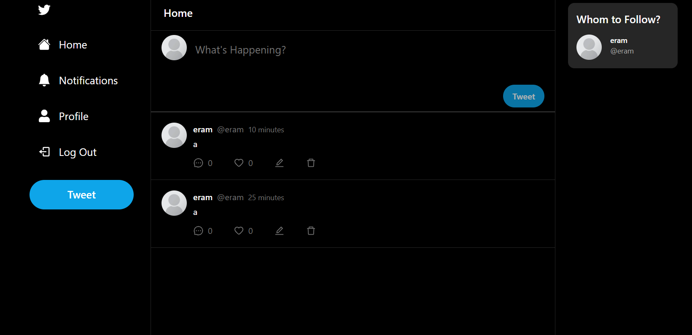
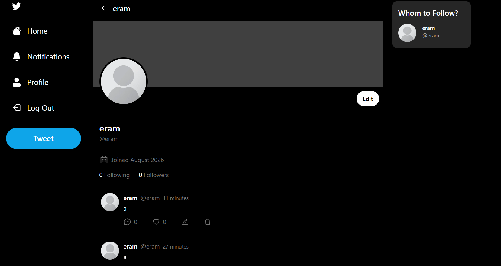
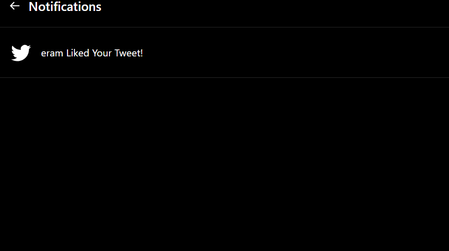
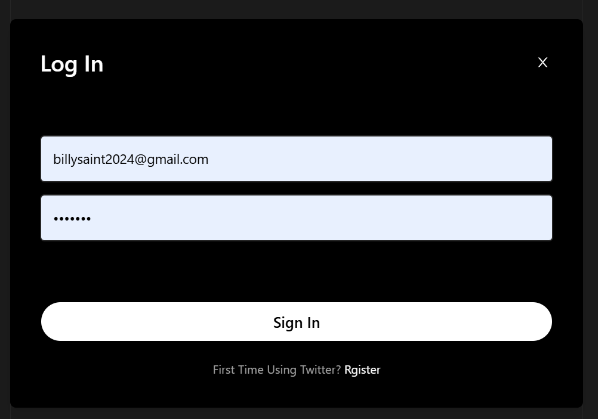

#  Social-X

A full-stack social media platform inspired by Twitter/X, built with Next.js, Prisma, MongoDB, and NextAuth.

## 📸 Screenshots

<p align="center">
  
  
</p>

<p align="center">
  
  
</p>

<p align="center">
  
</p>

[🌐 Live Demo](https://social-x-two.vercel.app/) • [💻 GitHub Repository](https://github.com/Alimul-Islam-Eram-Khan/Social-X)

Funcionalities:

- Authentication system
- Notification system
- Image Upload using Base64 strings
- Prisma ORM with MongoDB
- Responsive Layout
- 1 To Many Relations (User - Post)
- Many To Many Relations (Post - Comment)
- Following functionality
- Comments / Replies
- Likes functionality
- Vercel Deployment

🛠️ Tech Stack

### Frontend
- Next.js
- React
- CSS/Tailwind/etc.

### Backend
- Next.js API
- Prisma

### Database
- MongoDB

### Authentication
- NextAuth

### Deployment
- Vercel

---

🏗️ Architecture

```text
User
 ↓
Next.js
 ↓
API Routes
 ↓
Prisma
 ↓
MongoDB Atlas

### Cloning the repository

```shell
https://github.com/Alimul-Islam-Eram-Khan/Social-X.git
```

### Install packages

```shell
npm i
```

### Setup .env file

```js
DATABASE_URL=
NEXTAUTH_JWT_SECRET=
NEXTAUTH_SECRET=
```

### Start the app

```shell
npm run dev
```

## Available commands

Run Prisma Studio

```shell
npx prisma studio
```

Running Commands with NPM `npm run [command]`

| command | description                              |
| :------ | :--------------------------------------- |
| `dev`   | Starts a development instance of the app |
| `build` | Build instance of the app                |
| `start` | Run Build instance of the app            |
